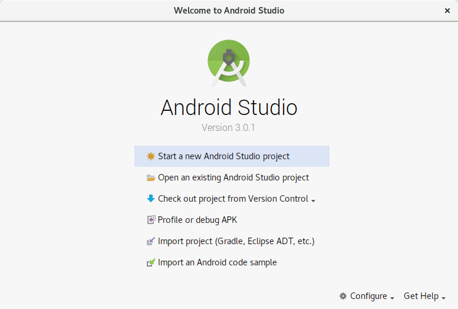
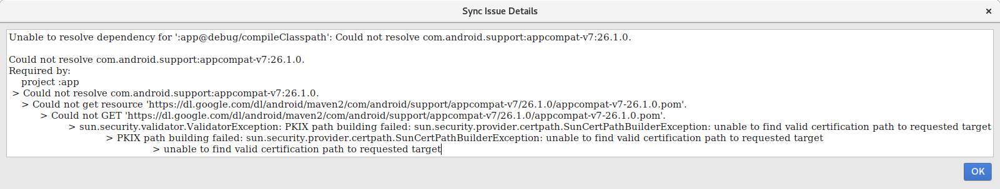

참고사이트
 - [https://developer.android.com/studio/index.html](https://developer.android.com/studio/index.html)  ( Android Studio 다운로드 )
 - [https://developer.android.com/studio/install.html](https://developer.android.com/studio/install.html) ( Android Studio 설치가이드 )


다운로드 하고서 ( android-studio-ide-<i>171.4443003-linux<i>.zip 파일 )

```bash
jinia@jin:~/Downloads$ ls -al
-rw-rw-r-- 1 jinia jinia 773670325 Feb 12 15:22 android-studio-ide-171.4443003-linux.zip
jinia@jin:~/Downloads$ 
```

압축 풀면  
( ~/Desktop/android-studio 에 압축 풀었음. )

```bash
jinia@jin:~/Downloads$ cd ~/Desktop/
jinia@jin:~/Desktop$ ls -al
total 12
drwxr-xr-x  3 jinia jinia 4096 Feb 12 15:29 .
drwxr-xr-x 36 jinia jinia 4096 Feb 12 15:31 ..
drwxrwxr-x  8 jinia jinia 4096 Nov 10 11:51 android-studio
jinia@jin:~/Desktop$ ls android-studio/ -al
total 56
drwxrwxr-x  8 jinia jinia  4096 Nov 10 11:51 .
drwxr-xr-x  3 jinia jinia  4096 Feb 12 15:29 ..
drwxrwxr-x  3 jinia jinia  4096 Nov 10 11:51 bin
-rw-r--r--  1 jinia jinia    14 Nov  9 10:26 build.txt
drwxrwxr-x  4 jinia jinia  4096 Nov 10 11:51 gradle
-rw-r--r--  1 jinia jinia  1934 Nov  9 10:26 Install-Linux-tar.txt
drwxrwxr-x  6 jinia jinia  4096 Nov 10 11:51 jre
drwxrwxr-x  5 jinia jinia  4096 Nov 10 11:51 lib
drwxrwxr-x  2 jinia jinia  4096 Nov 10 11:51 license
-rw-r--r--  1 jinia jinia 11352 Nov  9 10:26 LICENSE.txt
-rw-r--r--  1 jinia jinia   397 Nov  9 10:26 NOTICE.txt
drwxrwxr-x 39 jinia jinia  4096 Nov 10 11:51 plugins
jinia@jin:~/Desktop$ ls android-studio/bin/ -al
total 132
drwxrwxr-x 3 jinia jinia  4096 Nov 10 11:51 .
drwxrwxr-x 8 jinia jinia  4096 Nov 10 11:51 ..
-rw-r--r-- 1 jinia jinia   136 Nov  9 10:26 appletviewer.policy
-rwxr-xr-x 1 jinia jinia   227 Nov  9 10:26 format.sh
-rwxr-xr-x 1 jinia jinia 22874 Nov  9 10:26 fsnotifier
-rwxr-xr-x 1 jinia jinia 29236 Nov  9 10:26 fsnotifier64
-rw-r--r-- 1 jinia jinia 11188 Nov  9 10:26 idea.properties
-rwxr-xr-x 1 jinia jinia   278 Nov  9 10:26 inspect.sh
drwxrwxr-x 3 jinia jinia  4096 Nov 10 11:51 lldb
-rw-r--r-- 1 jinia jinia  2244 Nov  9 10:26 log.xml
-rwxr-xr-x 1 jinia jinia   410 Nov  9 10:26 printenv.py
-rwxr-xr-x 1 jinia jinia   590 Nov  9 10:26 restart.py
-rw-r--r-- 1 jinia jinia   310 Nov  9 10:26 studio64.vmoptions
-rw-r--r-- 1 jinia jinia  9816 Nov  9 10:26 studio.png
-rwxr-xr-x 1 jinia jinia  6985 Nov  9 10:26 studio.sh
-rw-r--r-- 1 jinia jinia   317 Nov  9 10:26 studio.vmoptions
jinia@jin:~/Desktop$ 
```


android sudio 실행하면 됨. 
```~/Desktop/android-studio/bin/studio.sh``` 을 실행하면 됨.  
최초 실행시에는 install 과정이 있으나, 두번째는 바로 실행됨. 

```bash
jinia@jin:~/Desktop$ cd android-studio/
jinia@jin:~/Desktop/android-studio$ ./bin/studio.sh 
Feb 12, 2018 3:30:39 PM java.util.prefs.FileSystemPreferences$1 run
INFO: Created user preferences directory.
Preparing "Install Android Support Repository (revision: 47.0.0)".
Downloading https://dl.google.com/android/repository/android_m2repository_r47.zip
"Install Android Support Repository (revision: 47.0.0)" ready.
Installing Android Support Repository in /home/jinia/Android/Sdk/extras/android/m2repository
"Install Android Support Repository (revision: 47.0.0)" complete.
"Install Android Support Repository (revision: 47.0.0)" finished.
Preparing "Install Android SDK Tools (revision: 26.1.1)".
Downloading https://dl.google.com/android/repository/sdk-tools-linux-4333796.zip
"Install Android SDK Tools (revision: 26.1.1)" ready.
Installing Android SDK Tools in /home/jinia/Android/Sdk/tools
"Install Android SDK Tools (revision: 26.1.1)" complete.
"Install Android SDK Tools (revision: 26.1.1)" finished.
Preparing "Install Android SDK Platform-Tools (revision: 27.0.1)".
Downloading https://dl.google.com/android/repository/platform-tools_r27.0.1-linux.zip
"Install Android SDK Platform-Tools (revision: 27.0.1)" ready.
Installing Android SDK Platform-Tools in /home/jinia/Android/Sdk/platform-tools
"Install Android SDK Platform-Tools (revision: 27.0.1)" complete.
"Install Android SDK Platform-Tools (revision: 27.0.1)" finished.
Preparing "Install SDK Patch Applier v4 (revision: 1)".
Downloading https://dl.google.com/android/repository/3534162-studio.sdk-patcher.zip.bak
"Install SDK Patch Applier v4 (revision: 1)" ready.
Installing SDK Patch Applier v4 in /home/jinia/Android/Sdk/patcher/v4
"Install SDK Patch Applier v4 (revision: 1)" complete.
"Install SDK Patch Applier v4 (revision: 1)" finished.
Preparing "Install Android Emulator (revision: 27.1.7)".
Downloading https://dl.google.com/android/repository/emulator-linux-4581633.zip
"Install Android Emulator (revision: 27.1.7)" ready.
Installing Android Emulator in /home/jinia/Android/Sdk/emulator
"Install Android Emulator (revision: 27.1.7)" complete.
"Install Android Emulator (revision: 27.1.7)" finished.
Preparing "Install Android SDK Build-Tools 27.0.3 (revision: 27.0.3)".
Downloading https://dl.google.com/android/repository/build-tools_r27.0.3-linux.zip
"Install Android SDK Build-Tools 27.0.3 (revision: 27.0.3)" ready.
Installing Android SDK Build-Tools 27.0.3 in /home/jinia/Android/Sdk/build-tools/27.0.3
"Install Android SDK Build-Tools 27.0.3 (revision: 27.0.3)" complete.
"Install Android SDK Build-Tools 27.0.3 (revision: 27.0.3)" finished.
Preparing "Install Google Repository (revision: 58)".
Downloading https://dl.google.com/android/repository/google_m2repository_gms_v11_3_rc05_wear_2_0_5.zip
"Install Google Repository (revision: 58)" ready.
Installing Google Repository in /home/jinia/Android/Sdk/extras/google/m2repository
"Install Google Repository (revision: 58)" complete.
"Install Google Repository (revision: 58)" finished.
Preparing "Install Sources for Android 27 (revision: 1)".
Downloading https://dl.google.com/android/repository/sources-27_r01.zip
"Install Sources for Android 27 (revision: 1)" ready.
Installing Sources for Android 27 in /home/jinia/Android/Sdk/sources/android-27
"Install Sources for Android 27 (revision: 1)" complete.
"Install Sources for Android 27 (revision: 1)" finished.
Preparing "Install Android SDK Platform 27 (revision: 1)".
Downloading https://dl.google.com/android/repository/platform-27_r01.zip
"Install Android SDK Platform 27 (revision: 1)" ready.
Installing Android SDK Platform 27 in /home/jinia/Android/Sdk/platforms/android-27
"Install Android SDK Platform 27 (revision: 1)" complete.
"Install Android SDK Platform 27 (revision: 1)" finished.
Parsing /home/jinia/Android/Sdk/build-tools/27.0.3/package.xml
Parsing /home/jinia/Android/Sdk/emulator/package.xml
Parsing /home/jinia/Android/Sdk/extras/android/m2repository/package.xml
Parsing /home/jinia/Android/Sdk/extras/google/m2repository/package.xml
Parsing /home/jinia/Android/Sdk/patcher/v4/package.xml
Parsing /home/jinia/Android/Sdk/platform-tools/package.xml
Parsing /home/jinia/Android/Sdk/platforms/android-27/package.xml
Parsing /home/jinia/Android/Sdk/sources/android-27/package.xml
Parsing /home/jinia/Android/Sdk/tools/package.xml
Android SDK is up to date.

Feb 12, 2018 3:39:27 PM com.google.api.client.googleapis.services.AbstractGoogleClient <init>
WARNING: Application name is not set. Call Builder#setApplicationName.
```


두번째 실행시에는 딱히 설치는 없는듯함. 


Android Studio가 실행되면.. 프로젝트를 생성하거나, 프로젝트를 불러올 수 있음.  
Configure 를 통해 android sdk 추가 설치 및 editor 설정 등이 가능함.



프로젝트 생성한 후, 다음과 같은 에러가 발생할 수 있음.  
사내보안정책에 의해 뭔가 차단된 것 같으니 정보시스템팀 통해서 조치해야함.  



