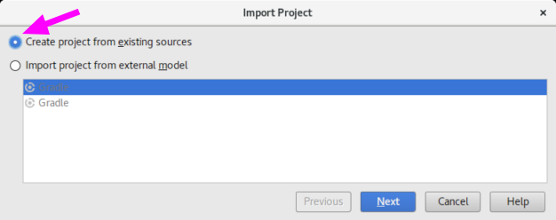
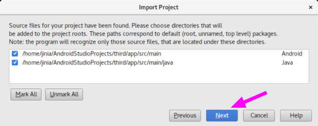
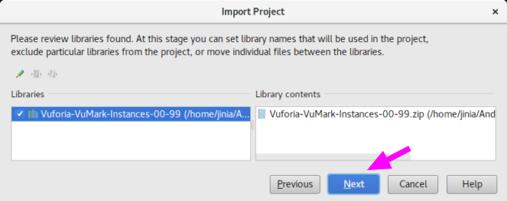
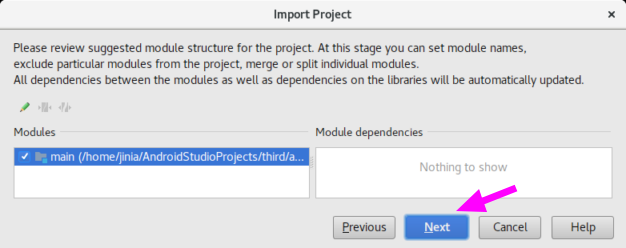
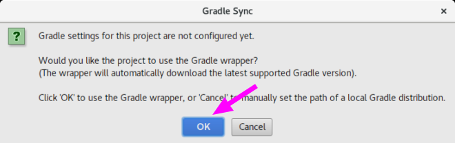

Git Repository에 예제 소스를 올리는 과정임. 

참고사이트
 - https://github.com/poscoict-arvrmr/third ( 예제소스를 올릴 Git Repository )

# VuforiaSamples-7-0-47.zip

먼저 Vuforia Developer Portal 에서 다운로드 받은 예제중에서 다음을 가지고.. GitHub에 올려볼 예정임.

* vuforia-samples-core-android-7-0-47.zip > VuforiaSamples-7-0-47.zip

```bash
jinia@jin:~/Downloads$ ls -al vuforia-samples-core-android-7-0-47*
-rw-rw-r-- 1 jinia jinia 54466795 Feb 21 17:26 vuforia-samples-core-android-7-0-47.zip

vuforia-samples-core-android-7-0-47:
total 53204
drwxr-xr-x 2 jinia jinia     4096 Feb 26 13:43 .
drwxr-xr-x 6 jinia jinia     4096 Feb 23 17:56 ..
-rw-rw-r-- 1 jinia jinia 10036195 Jan  5 19:30 GroundPlane-7-0-47.zip
-rw-rw-r-- 1 jinia jinia  9730415 Jan  5 19:30 ModelTargets-7-0-47.zip
-rw-rw-r-- 1 jinia jinia 34699795 Jan  5 19:30 VuforiaSamples-7-0-47.zip
jinia@jin:~/Downloads$ 
```


일단 압축 풀고... VuforiaSamples-7-0-47 디렉토리로 이동함. 

```bash
jinia@jin:~/Downloads/vuforia-samples-core-android-7-0-47$ unzip VuforiaSamples-7-0-47.zip -d VuforiaSamples-7-0-47
Archive:  VuforiaSamples-7-0-47.zip
 extracting: VuforiaSamples-7-0-47/license.txt  
 extracting: VuforiaSamples-7-0-47/settings.gradle  
 extracting: VuforiaSamples-7-0-47/build.gradle  
 extracting: VuforiaSamples-7-0-47/gradle.properties  
 extracting: VuforiaSamples-7-0-47/app/build.gradle  
 extracting: VuforiaSamples-7-0-47/app/proguard-rules.pro  
 extracting: VuforiaSamples-7-0-47/app/src/main/AndroidManifest.xml  
 ... 중략 ...

jinia@jin:~/Downloads/vuforia-samples-core-android-7-0-47$ cd VuforiaSamples-7-0-47/
jinia@jin:~/Downloads/vuforia-samples-core-android-7-0-47/VuforiaSamples-7-0-47$ ls -al
total 32
drwxr-xr-x 4 jinia jinia 4096 Feb 26 14:12 .
drwxr-xr-x 3 jinia jinia 4096 Feb 26 14:12 ..
drwxr-xr-x 3 jinia jinia 4096 Feb 26 14:12 app
-rwxrwxrwx 1 jinia jinia  436 Jan  5 19:30 build.gradle
-rwxrwxrwx 1 jinia jinia  855 Jan  5 19:30 gradle.properties
-rwxrwxrwx 1 jinia jinia  506 Jan  5 19:30 license.txt
drwxr-xr-x 2 jinia jinia 4096 Feb 26 14:12 media
-rwxrwxrwx 1 jinia jinia   15 Jan  5 19:30 settings.gradle
jinia@jin:~/Downloads/vuforia-samples-core-android-7-0-47/VuforiaSamples-7-0-47$ 
```

# GitHub 에 올리기

git 초기화 하고... pull 하고.. 
stage에 add하고.. stage commit 하고.. 
remote add 해서 push 하는 과정인듯함. 

## git 명령어

```
git init
git pull https://github.com/poscoict-arvrmr/third.git -f
git add -A
git commit -m 'first commit'
git remote add origin https://github.com/poscoict-arvrmr/third.git
git push -u origin master
```

## 결과

다음은 실행 과정임. 

```bash
jinia@jin:~/Downloads/vuforia-samples-core-android-7-0-47/VuforiaSamples-7-0-47$ ls
app  build.gradle  gradle.properties  license.txt  media  settings.gradle
jinia@jin:~/Downloads/vuforia-samples-core-android-7-0-47/VuforiaSamples-7-0-47$ git init
Initialized empty Git repository in /home/jinia/Downloads/vuforia-samples-core-android-7-0-47/VuforiaSamples-7-0-47/.git/
jinia@jin:~/Downloads/vuforia-samples-core-android-7-0-47/VuforiaSamples-7-0-47$ git pull https://github.com/poscoict-arvrmr/third.git -f
remote: Counting objects: 3, done.
remote: Compressing objects: 100% (2/2), done.
remote: Total 3 (delta 0), reused 0 (delta 0), pack-reused 0
Unpacking objects: 100% (3/3), done.
From https://github.com/poscoict-arvrmr/third
 * branch            HEAD       -> FETCH_HEAD
jinia@jin:~/Downloads/vuforia-samples-core-android-7-0-47/VuforiaSamples-7-0-47$ ls
app  build.gradle  gradle.properties  license.txt  media  README.md  settings.gradle
jinia@jin:~/Downloads/vuforia-samples-core-android-7-0-47/VuforiaSamples-7-0-47$ git add -A
jinia@jin:~/Downloads/vuforia-samples-core-android-7-0-47/VuforiaSamples-7-0-47$ git commit -m 'first commit'
[master (root-commit) ec3b677] first commit
 175 files changed, 261979 insertions(+)
 create mode 100755 app/build.gradle
 create mode 100755 app/proguard-rules.pro
 create mode 100755 app/src/main/AndroidManifest.xml
 ... 중략 ...
 
jinia@jin:~/Downloads/vuforia-samples-core-android-7-0-47/VuforiaSamples-7-0-47$ git remote add origin https://github.com/poscoict-arvrmr/third.git
jinia@jin:~/Downloads/vuforia-samples-core-android-7-0-47/VuforiaSamples-7-0-47$ git push -u origin master
Username for 'https://github.com': jinfromkorea
Password for 'https://jinfromkorea@github.com': 
Counting objects: 218, done.
Delta compression using up to 4 threads.
Compressing objects: 100% (205/205), done.
Writing objects: 100% (218/218), 25.17 MiB | 958.00 KiB/s, done.
Total 218 (delta 53), reused 0 (delta 0)
remote: Resolving deltas: 100% (53/53), done.
To https://github.com/poscoict-arvrmr/third.git
   17ea8fb..21e54d3  master -> master
Branch master set up to track remote branch master from origin.
jinia@jin:~/Downloads/vuforia-samples-core-android-7-0-47/VuforiaSamples-7-0-47$ 
```

https://github.com/poscoict-arvrmr/third 에 commit 여부 확인한 후에 VuforiaSamples-7-0-47 디렉토리는 삭제해버렸음.  

```bash
jinia@jin:~/Downloads/vuforia-samples-core-android-7-0-47/VuforiaSamples-7-0-47$ cd ..
jinia@jin:~/Downloads/vuforia-samples-core-android-7-0-47$ rm -rm VuforiaSamples-7-0-47/
jinia@jin:~/Downloads/vuforia-samples-core-android-7-0-47$
```

# Android Studio 에서 열기

android studio를 실행하면.. Version Control 에서 project를 checkout 해 올 수 있음.  
GitHub, CVS, Git, Google Cloud, Mercurial, Subversion 으로 부터 checkout이 가능함.  
세번째 Git을 선택해서 checkout 해올 것임. 


clone 해 올 repository 주소를 적어주면 됨.  

 * https://github.com/poscoict-arvrmr/third.git


그 뒤로는 일단 적당히 선택해서 Next 해서 project를 import함. 









Gradle Sync 는 OK 하고..  



Git에 Add 하는것은 unchecked 하는게 좋을 것 같고.   
자동으론 생성되는 파일들로 파악됨.   


Gradle Plugin은 Update 해주는게 좋을 듯 하고.. 


프로젝트 import가 다 되면 다음과 같은 오류가 발생함. 


# 소스 수정하기

 * .gitignore 파일생성

 * vuforia sdk 경로 수정

 * license key 수정 

## .gitignore 파일 생성

일단 ```.gitignore``` 파일을 생성함. 

```bash
jinia@jin:~/Downloads/vuforia-samples-core-android-7-0-47$ cd ~/AndroidStudioProjects/third/
jinia@jin:~/AndroidStudioProjects/third$ touch .gitignore
jinia@jin:~/AndroidStudioProjects/third$ 
```

테스트용으로 Vuforia Sample 프로젝트 가져와서 생성되는 파일과 Zip 파일에 있던 파일 비교해서 
```.gitignore``` 대상이 될 만한 폴더와 파일을 추렸음. 

```
.gradle
.idea
build
gradle
app/app.iml
app/src/main/gen
third.iml
gradlew
gradlew.bat
local.properties
```


마우스 오른쪽 팝업 메뉴을 통해 Add to VCS 를 하면 되고.. Unversioned Files 에서 Default로 위치가 변경됨. 

## git 올리기

Version Control 의 Local Changes 탭에서 변경사항을 확인하고..  표시된 버튼을 클릭한다. 


Commit Change 다이얼로그에서 Commit Message를 입력하고..  Commit 버튼( Commit And Push 를 선택하길 ) 에서 Push까지 선택한다. 


Push Commits 다이얼로그에서 Push를 클릭한다. 


Version Control 의 Log 탭에서 히스토리를 확인할 수 있다. 


