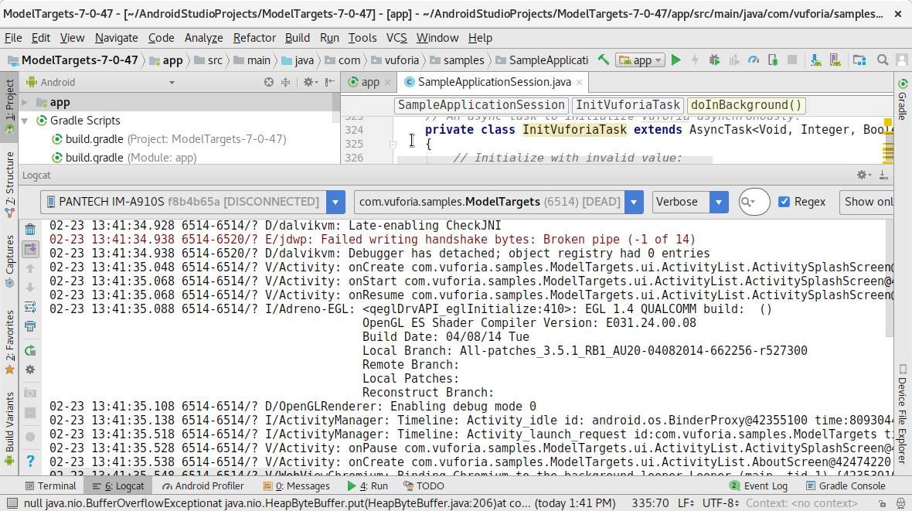
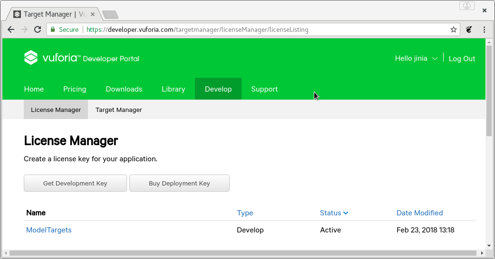
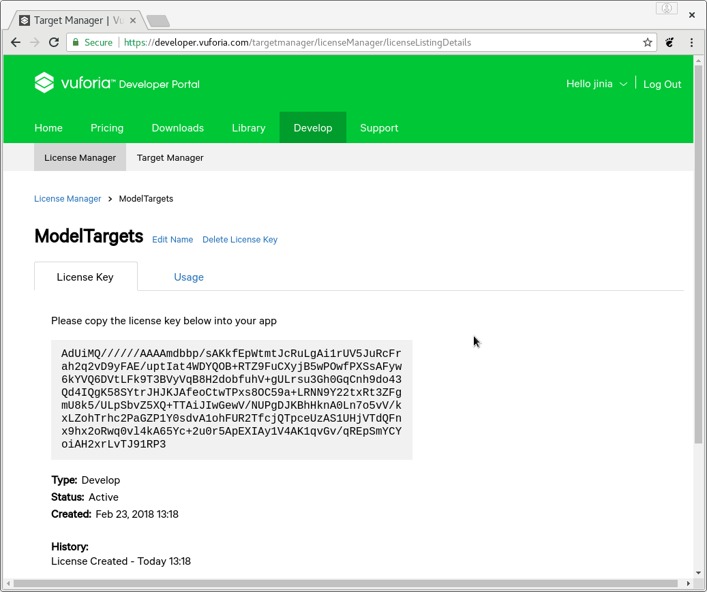
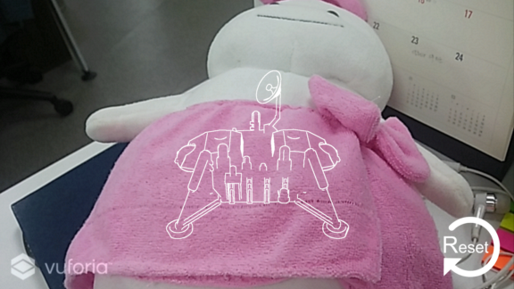

Vuforia 다운로드 사이트
 - [https://developer.vuforia.com/downloads/sdk](https://developer.vuforia.com/downloads/sdk)  ( SDK )
 - [https://developer.vuforia.com/downloads/samples](https://developer.vuforia.com/downloads/samples) ( Samples )
 - [https://developer.vuforia.com/downloads/tool](https://developer.vuforia.com/downloads/tool) ( Tools )

Vuforia Developer Portal 의 다운로드 화면. 


# SDK

[SDK 다운로드 사이트](https://developer.vuforia.com/downloads/sdk) 에서 
android용 ```vuforia-sdk-android-7-0-47.zip``` 을 다운로드해서.. 압축 풀면 됨. 

```bash
jinia@jin:~/Downloads$ ls
android-studio-ide-171.4443003-linux.zip  
vuforia-sdk-android-7-0-47.zip
jinia@jin:~/Downloads$ unzip vuforia-sdk-android-7-0-47.zip -d ~/Android/vuforia-sdk-android-7-0-47/
Archive:  vuforia-sdk-android-7-0-47.zip
   creating: /home/jinia/Android/vuforia-sdk-android-7-0-47/build/
   creating: /home/jinia/Android/vuforia-sdk-android-7-0-47/build/java/
   creating: /home/jinia/Android/vuforia-sdk-android-7-0-47/build/java/vuforia/
  inflating: /home/jinia/Android/vuforia-sdk-android-7-0-47/build/java/vuforia/Vuforia.jar  

... 중략 ...  

  inflating: /home/jinia/Android/vuforia-sdk-android-7-0-47/readme.txt  
jinia@jin:~/Downloads$ 
```

# Samples

[Sample 다운로드 사이트](https://developer.vuforia.com/downloads/samples) 에서 
android용으로 4가지(Core Features, Digtal Eyewear, Andvanced Topics, Best Practice)를 다운로드 해서 압축 풀면 됨

sample 안에는 zip 파일들이 들어가 있고. zip 파일은 각각 project 이므로 
압축 풀어서 android studio에서 열어보면 됨. 

```bash
jinia@jin:~/Downloads$ ls
android-studio-ide-171.4443003-linux.zip  
vuforia-samples-advanced-android-7-0-47.zip
vuforia-samples-core-android-7-0-47.zip
vuforia-samples-eyewear-android-7-0-47.zip
vuforia-samples-practices-android-7-0-47.zip
vuforia-sdk-android-7-0-47.zip
jinia@jin:~/Downloads$ unzip vuforia-samples-core-android-7-0-47.zip -d vuforia-samples-core-android-7-0-47/
Archive:  vuforia-samples-core-android-7-0-47.zip
 extracting: vuforia-samples-core-android-7-0-47/ModelTargets-7-0-47.zip  
 extracting: vuforia-samples-core-android-7-0-47/GroundPlane-7-0-47.zip  
 extracting: vuforia-samples-core-android-7-0-47/VuforiaSamples-7-0-47.zip  
jinia@jin:~/Downloads$ unzip vuforia-samples-eyewear-android-7-0-47.zip -d vuforia-samples-eyewear-android-7-0-47
Archive:  vuforia-samples-eyewear-android-7-0-47.zip
 extracting: vuforia-samples-eyewear-android-7-0-47/ARVR-7-0-47.zip  
 extracting: vuforia-samples-eyewear-android-7-0-47/StereoRendering-7-0-47.zip  
jinia@jin:~/Downloads$ unzip vuforia-samples-advanced-android-7-0-47.zip -d vuforia-samples-advanced-android-7-0-47
Archive:  vuforia-samples-advanced-android-7-0-47.zip
 extracting: vuforia-samples-advanced-android-7-0-47/VideoPlayback-7-0-47.zip  
 extracting: vuforia-samples-advanced-android-7-0-47/ImageTargetsNative-7-0-47.zip  
 extracting: vuforia-samples-advanced-android-7-0-47/BackgroundTextureAccess-7-0-47.zip  
 extracting: vuforia-samples-advanced-android-7-0-47/Dominoes-7-0-47.zip  
 extracting: vuforia-samples-advanced-android-7-0-47/OcclusionManagement-7-0-47.zip  
jinia@jin:~/Downloads$ unzip vuforia-samples-practices-android-7-0-47.zip -d vuforia-samples-practices-android-7-0-47
Archive:  vuforia-samples-practices-android-7-0-47.zip
 extracting: vuforia-samples-practices-android-7-0-47/Books-7-0-47.zip  
jinia@jin:~/Downloads$ 
```

다음은 ModelTargets-7-0-47.zip 을 압축 푼거임. 

```bash
jinia@jin:~/Downloads$ unzip vuforia-samples-core-android-7-0-47/ModelTargets-7-0-47.zip -d ~/AndroidStudioProjects/ModelTargets-7-0-47/
Archive:  vuforia-samples-core-android-7-0-47/ModelTargets-7-0-47.zip
 extracting: /home/jinia/AndroidStudioProjects/ModelTargets-7-0-47/license.txt  
 extracting: /home/jinia/AndroidStudioProjects/ModelTargets-7-0-47/settings.gradle  
 extracting: /home/jinia/AndroidStudioProjects/ModelTargets-7-0-47/build.gradle  
 extracting: /home/jinia/AndroidStudioProjects/ModelTargets-7-0-47/gradle.properties  
 extracting: /home/jinia/AndroidStudioProjects/ModelTargets-7-0-47/app/build.gradle  
 extracting: /home/jinia/AndroidStudioProjects/ModelTargets-7-0-47/app/proguard-rules.pro  
 extracting: /home/jinia/AndroidStudioProjects/ModelTargets-7-0-47/app/src/main/AndroidManifest.xml  

 ... 중략 ...
 
jinia@jin:~/Downloads$ 
```

## Vuforia SDK 경로

Android Studio에서 프로젝트를 열어보면 오류가 남. 
Vuforia.jar 파일을 찾지 못한다는 오류임. 

```ModelTargets-7-0-47/app/build.gradle``` 파일에 sdk 경로를 정의하고 있으므로 이를 수정하면 됨. 
다음 sample project도 마찬가지임. 

```bash
jinia@jin:~/Downloads$ cat ~/AndroidStudioProjects/ModelTargets-7-0-47/app/build.gradle 
apply plugin: 'com.android.application'

def VUFORIA_SDK_DIR = '../../..'
def NATIVE_LIB_DIR = 'build/lib'
def JAR_DIR = 'build/java/vuforia'

... 중략 ...

dependencies {
    compile files("$VUFORIA_SDK_DIR/$JAR_DIR/Vuforia.jar")
}
```

다음과 같이 수정했음. 각자 환경에 맞게 지정하면 됨. 

```
// 수정 전
//def VUFORIA_SDK_DIR = '../../..'
// 수정 후 : vuforia sdk를 다운로드 해서 압축 푼 위치여야 함. 
def VUFORIA_SDK_DIR = '../../../Android/vuforia-sdk-android-7-0-47'
```

2018.02.23 일 기준으로 
Android Studio에서 Project를 열어서 실행시켰더니 Failed to initialize Vuforia 에러가 발생했음. 


## Logcat

Android Studio 에 디바이스(핸드폰)이 연결되면 Logcat 창을 통해 앱의 실행 로그를 볼수 있음. 




Logcat 에서 ModelTargets 앱의 로그는 다음과 같았고,  
```No Vuforia license key defined!``` 가 보일 것임. 

```
02-23 13:11:35.548 4692-4692/? D/dalvikvm: Late-enabling CheckJNI
02-23 13:11:35.688 4692-4692/com.vuforia.samples.ModelTargets V/Activity: onCreate com.vuforia.samples.ModelTargets.ui.ActivityList.ActivitySplashScreen@423596c8: null
02-23 13:11:35.708 4692-4692/com.vuforia.samples.ModelTargets V/Activity: onStart com.vuforia.samples.ModelTargets.ui.ActivityList.ActivitySplashScreen@423596c8
02-23 13:11:35.708 4692-4692/com.vuforia.samples.ModelTargets V/Activity: onResume com.vuforia.samples.ModelTargets.ui.ActivityList.ActivitySplashScreen@423596c8
02-23 13:11:35.738 4692-4692/com.vuforia.samples.ModelTargets I/Adreno-EGL: <qeglDrvAPI_eglInitialize:410>: EGL 1.4 QUALCOMM build:  ()
                                                                            OpenGL ES Shader Compiler Version: E031.24.00.08
                                                                            Build Date: 04/08/14 Tue
                                                                            Local Branch: All-patches_3.5.1_RB1_AU20-04082014-662256-r527300
                                                                            Remote Branch: 
                                                                            Local Patches: 
                                                                            Reconstruct Branch: 
02-23 13:11:35.758 4692-4692/com.vuforia.samples.ModelTargets D/OpenGLRenderer: Enabling debug mode 0
02-23 13:11:35.788 4692-4692/com.vuforia.samples.ModelTargets I/ActivityManager: Timeline: Activity_idle id: android.os.BinderProxy@42354d98 time:79693050
02-23 13:11:36.168 4692-4692/com.vuforia.samples.ModelTargets I/ActivityManager: Timeline: Activity_launch_request id:com.vuforia.samples.ModelTargets time:79693431
02-23 13:11:36.178 4692-4692/com.vuforia.samples.ModelTargets V/Activity: onPause com.vuforia.samples.ModelTargets.ui.ActivityList.ActivitySplashScreen@423596c8
02-23 13:11:36.188 4692-4692/com.vuforia.samples.ModelTargets V/Activity: onCreate com.vuforia.samples.ModelTargets.ui.ActivityList.AboutScreen@42473e18: null
02-23 13:11:36.208 4692-4692/com.vuforia.samples.ModelTargets V/WebViewChromium: Binding Chromium to the background looper Looper (main, tid 1) {423534e8}
02-23 13:11:36.208 4692-4692/com.vuforia.samples.ModelTargets I/chromium: [INFO:library_loader_hooks.cc(112)] Chromium logging enabled: level = 0, default verbosity = 0
02-23 13:11:36.208 4692-4692/com.vuforia.samples.ModelTargets I/BrowserProcessMain: Initializing chromium process, renderers=0
02-23 13:11:36.218 4692-4735/com.vuforia.samples.ModelTargets W/chromium: [WARNING:proxy_service.cc(888)] PAC support disabled because there is no system implementation
02-23 13:11:36.288 4692-4692/com.vuforia.samples.ModelTargets V/Activity: onStart com.vuforia.samples.ModelTargets.ui.ActivityList.AboutScreen@42473e18
02-23 13:11:36.288 4692-4692/com.vuforia.samples.ModelTargets V/Activity: onResume com.vuforia.samples.ModelTargets.ui.ActivityList.AboutScreen@42473e18
02-23 13:11:36.328 4692-4692/com.vuforia.samples.ModelTargets W/AwContents: nativeOnDraw failed; clearing to background color.
02-23 13:11:36.358 4692-4692/com.vuforia.samples.ModelTargets W/AwContents: nativeOnDraw failed; clearing to background color.
02-23 13:11:36.398 4692-4692/com.vuforia.samples.ModelTargets I/ActivityManager: Timeline: Activity_idle id: android.os.BinderProxy@42473420 time:79693660
02-23 13:11:36.738 4692-4692/com.vuforia.samples.ModelTargets I/chromium: [INFO:async_pixel_transfer_manager_android.cc(56)] Async pixel transfers not supported
02-23 13:11:36.768 4692-4692/com.vuforia.samples.ModelTargets I/chromium: [INFO:async_pixel_transfer_manager_android.cc(56)] Async pixel transfers not supported
02-23 13:11:36.788 4692-4692/com.vuforia.samples.ModelTargets V/Activity: onSaveInstanceState com.vuforia.samples.ModelTargets.ui.ActivityList.ActivitySplashScreen@423596c8: Bundle[{android:viewHierarchyState=Bundle[{android:views={16908290=android.view.AbsSavedState$1@421534f0, 2130968581=android.view.AbsSavedState$1@421534f0, 2130968588=android.view.AbsSavedState$1@421534f0}}]}]
02-23 13:11:36.788 4692-4692/com.vuforia.samples.ModelTargets V/Activity: onStop com.vuforia.samples.ModelTargets.ui.ActivityList.ActivitySplashScreen@423596c8
02-23 13:12:04.078 4692-4692/com.vuforia.samples.ModelTargets I/ActivityManager: Timeline: Activity_launch_request id:com.vuforia.samples.ModelTargets time:79721345
02-23 13:12:04.098 4692-4692/com.vuforia.samples.ModelTargets V/Activity: onPause com.vuforia.samples.ModelTargets.ui.ActivityList.AboutScreen@42473e18
02-23 13:12:04.118 4692-4692/com.vuforia.samples.ModelTargets D/ModelTargets: onCreate
02-23 13:12:04.118 4692-4692/com.vuforia.samples.ModelTargets V/Activity: onCreate com.vuforia.samples.ModelTargets.app.ModelTargets.ModelTargets@426d9900: null
02-23 13:12:04.148 4692-4757/com.vuforia.samples.ModelTargets D/dalvikvm: Trying to load lib /data/app-lib/com.vuforia.samples.ModelTargets-1/libVuforia.so 0x42357f18
02-23 13:12:04.158 4692-4757/com.vuforia.samples.ModelTargets D/dalvikvm: Added shared lib /data/app-lib/com.vuforia.samples.ModelTargets-1/libVuforia.so 0x42357f18
02-23 13:12:04.158 4692-4757/com.vuforia.samples.ModelTargets I/System.out: Native library libVuforia.so loaded
02-23 13:12:04.168 4692-4757/com.vuforia.samples.ModelTargets E/AR: No Vuforia license key defined!
02-23 13:12:04.198 4692-4692/com.vuforia.samples.ModelTargets D/dalvikvm: GC_FOR_ALLOC freed 635K, 12% free 10571K/11988K, paused 13ms, total 13ms
02-23 13:12:04.208 4692-4692/com.vuforia.samples.ModelTargets I/dalvikvm-heap: Grow heap (frag case) to 16.826MB for 4194320-byte allocation
02-23 13:12:04.228 4692-4692/com.vuforia.samples.ModelTargets D/dalvikvm: GC_FOR_ALLOC freed 3K, 9% free 14664K/16088K, paused 11ms, total 11ms
02-23 13:12:04.228 4692-4692/com.vuforia.samples.ModelTargets I/dalvikvm-heap: Grow heap (frag case) to 20.823MB for 4194320-byte allocation
02-23 13:12:04.258 4692-4692/com.vuforia.samples.ModelTargets D/dalvikvm: GC_FOR_ALLOC freed <1K, 8% free 18760K/20188K, paused 9ms, total 9ms
02-23 13:12:04.268 4692-4692/com.vuforia.samples.ModelTargets D/ModelTargets: onResume
02-23 13:12:04.268 4692-4692/com.vuforia.samples.ModelTargets V/Activity: onStart com.vuforia.samples.ModelTargets.app.ModelTargets.ModelTargets@426d9900
02-23 13:12:04.268 4692-4692/com.vuforia.samples.ModelTargets V/Activity: onResume com.vuforia.samples.ModelTargets.app.ModelTargets.ModelTargets@426d9900
02-23 13:12:04.278 4692-4692/com.vuforia.samples.ModelTargets V/Activity: onDestroy com.vuforia.samples.ModelTargets.ui.ActivityList.ActivitySplashScreen@423596c8
02-23 13:12:04.278 4692-4692/com.vuforia.samples.ModelTargets E/SampleAppSession: InitVuforiaTask.onPostExecute: Failed to initialize Vuforia. Exiting.
02-23 13:12:04.278 4692-4692/com.vuforia.samples.ModelTargets E/ModelTargets: Failed to initialize Vuforia.
02-23 13:12:04.398 4692-4692/com.vuforia.samples.ModelTargets I/ActivityManager: Timeline: Activity_idle id: android.os.BinderProxy@426d8538 time:79721663
02-23 13:12:04.678 4692-4692/com.vuforia.samples.ModelTargets V/Activity: onSaveInstanceState com.vuforia.samples.ModelTargets.ui.ActivityList.AboutScreen@42473e18: Bundle[{android:viewHierarchyState=Bundle[{android:views={16908290=android.view.AbsSavedState$1@421534f0, 2130968576=android.view.AbsSavedState$1@421534f0, 2130968577=android.view.AbsSavedState$1@421534f0, 2130968578=android.view.AbsSavedState$1@421534f0}, android:focusedViewId=2130968576}]}]
02-23 13:12:04.678 4692-4692/com.vuforia.samples.ModelTargets V/Activity: onStop com.vuforia.samples.ModelTargets.ui.ActivityList.AboutScreen@42473e18
```


Vuforia Developer Portal 사이트 가서 라이센스를 얻어와야 함. 

## Vuforia License Manager

그림과 같이 Vuforia Developer Portal 사이트의 Develop 화면으로 이동하면 License Manager를 통해 Development Key를 생성할 수 있음.  

생성된 License Key를 복사해서 app에 넣으면 됨. 






## how to add 

License Key를 app에 넣는 방법 역시 Vuforia Developer Portal 사이트에서 찾으면 됨. 

 - [https://library.vuforia.com/articles/Solution/How-To-add-a-License-Key-to-your-Vuforia-App.html](https://library.vuforia.com/articles/Solution/How-To-add-a-License-Key-to-your-Vuforia-App.html)


가이드에 따라.. ( Adding a License Key to a native Android app 부분을 찾아서 볼 것)
```Vuforia.setInitParameters(mActivity, mVuforiaFlags, " your_license_key ");``` 라는 소스를 찾아야 함. 

ModelTargets 프로젝트의 경우 다음 파일이 여기에 해당되었음. ( 335 라인쯤 )

```
~/AndroidStudioProjects/ModelTargets-7-0-47/app/src/main/java/com/vuforia/samples/SampleApplication/SampleApplicationSession.java
```

```Vuforia.setInitParameters(mActivity, mVuforiaFlags, "");``` 의 3번째 인자값을 수정하면 됨.


```java
    private class InitVuforiaTask extends AsyncTask<Void, Integer, Boolean>
    {

... 중략 ...
        
        protected Boolean doInBackground(Void... params)
        {
            // Prevent the onDestroy() method to overlap with initialization:
            synchronized (mShutdownLock)
            {
                Vuforia.setInitParameters(mActivity, mVuforiaFlags, "");
                
... 중략 ...

```

카메라 화면에 모델이 하나 올라오면 되는듯 함. 


