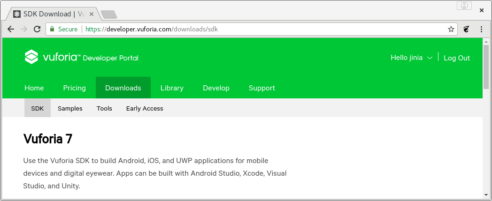
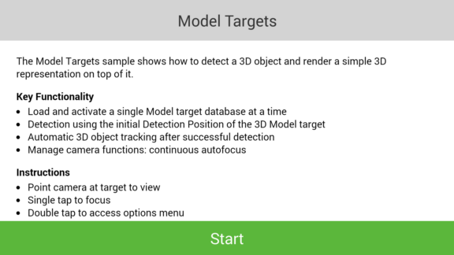
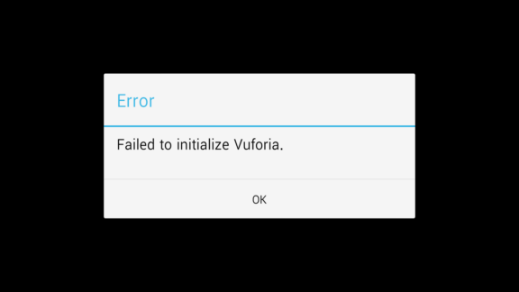

Vuforia 다운로드 사이트
 - [https://developer.vuforia.com/downloads/sdk](https://developer.vuforia.com/downloads/sdk)  ( SDK )
 - [https://developer.vuforia.com/downloads/samples](https://developer.vuforia.com/downloads/samples) ( Samples )
 - [https://developer.vuforia.com/downloads/tool](https://developer.vuforia.com/downloads/tool) ( Tools )

Vuforia Developer Portal 의 다운로드 화면. 



# SDK

[SDK 다운로드 사이트](https://developer.vuforia.com/downloads/sdk) 에서 
android용 ```vuforia-sdk-android-7-0-47.zip``` 을 다운로드해서.. 압축 풀면 됨. 

```bash
jinia@jin:~/Downloads$ ls
android-studio-ide-171.4443003-linux.zip  
vuforia-sdk-android-7-0-47.zip
jinia@jin:~/Downloads$ unzip vuforia-sdk-android-7-0-47.zip -d ~/Android/vuforia-sdk-android-7-0-47/
Archive:  vuforia-sdk-android-7-0-47.zip
   creating: /home/jinia/Android/vuforia-sdk-android-7-0-47/build/
   creating: /home/jinia/Android/vuforia-sdk-android-7-0-47/build/java/
   creating: /home/jinia/Android/vuforia-sdk-android-7-0-47/build/java/vuforia/
  inflating: /home/jinia/Android/vuforia-sdk-android-7-0-47/build/java/vuforia/Vuforia.jar  

... 중략 ...  

  inflating: /home/jinia/Android/vuforia-sdk-android-7-0-47/readme.txt  
jinia@jin:~/Downloads$ 
```

# Samples

[Sample 다운로드 사이트](https://developer.vuforia.com/downloads/samples) 에서 
android용으로 4가지(Core Features, Digtal Eyewear, Andvanced Topics, Best Practice)를 다운로드 해서 압축 풀면 됨

sample 안에는 zip 파일들이 들어가 있고. zip 파일은 각각 project 이므로 
압축 풀어서 android studio에서 열어보면 됨. 

```bash
jinia@jin:~/Downloads$ ls
android-studio-ide-171.4443003-linux.zip  
vuforia-samples-advanced-android-7-0-47.zip
vuforia-samples-core-android-7-0-47.zip
vuforia-samples-eyewear-android-7-0-47.zip
vuforia-samples-practices-android-7-0-47.zip
vuforia-sdk-android-7-0-47.zip
jinia@jin:~/Downloads$ unzip vuforia-samples-core-android-7-0-47.zip -d vuforia-samples-core-android-7-0-47/
Archive:  vuforia-samples-core-android-7-0-47.zip
 extracting: vuforia-samples-core-android-7-0-47/ModelTargets-7-0-47.zip  
 extracting: vuforia-samples-core-android-7-0-47/GroundPlane-7-0-47.zip  
 extracting: vuforia-samples-core-android-7-0-47/VuforiaSamples-7-0-47.zip  
jinia@jin:~/Downloads$ unzip vuforia-samples-eyewear-android-7-0-47.zip -d vuforia-samples-eyewear-android-7-0-47
Archive:  vuforia-samples-eyewear-android-7-0-47.zip
 extracting: vuforia-samples-eyewear-android-7-0-47/ARVR-7-0-47.zip  
 extracting: vuforia-samples-eyewear-android-7-0-47/StereoRendering-7-0-47.zip  
jinia@jin:~/Downloads$ unzip vuforia-samples-advanced-android-7-0-47.zip -d vuforia-samples-advanced-android-7-0-47
Archive:  vuforia-samples-advanced-android-7-0-47.zip
 extracting: vuforia-samples-advanced-android-7-0-47/VideoPlayback-7-0-47.zip  
 extracting: vuforia-samples-advanced-android-7-0-47/ImageTargetsNative-7-0-47.zip  
 extracting: vuforia-samples-advanced-android-7-0-47/BackgroundTextureAccess-7-0-47.zip  
 extracting: vuforia-samples-advanced-android-7-0-47/Dominoes-7-0-47.zip  
 extracting: vuforia-samples-advanced-android-7-0-47/OcclusionManagement-7-0-47.zip  
jinia@jin:~/Downloads$ unzip vuforia-samples-practices-android-7-0-47.zip -d vuforia-samples-practices-android-7-0-47
Archive:  vuforia-samples-practices-android-7-0-47.zip
 extracting: vuforia-samples-practices-android-7-0-47/Books-7-0-47.zip  
jinia@jin:~/Downloads$ 
```

다음은 ModelTargets-7-0-47.zip 을 압축 푼거임. 

```bash
jinia@jin:~/Downloads$ unzip vuforia-samples-core-android-7-0-47/ModelTargets-7-0-47.zip -d ~/AndroidStudioProjects/ModelTargets-7-0-47/
Archive:  vuforia-samples-core-android-7-0-47/ModelTargets-7-0-47.zip
 extracting: /home/jinia/AndroidStudioProjects/ModelTargets-7-0-47/license.txt  
 extracting: /home/jinia/AndroidStudioProjects/ModelTargets-7-0-47/settings.gradle  
 extracting: /home/jinia/AndroidStudioProjects/ModelTargets-7-0-47/build.gradle  
 extracting: /home/jinia/AndroidStudioProjects/ModelTargets-7-0-47/gradle.properties  
 extracting: /home/jinia/AndroidStudioProjects/ModelTargets-7-0-47/app/build.gradle  
 extracting: /home/jinia/AndroidStudioProjects/ModelTargets-7-0-47/app/proguard-rules.pro  
 extracting: /home/jinia/AndroidStudioProjects/ModelTargets-7-0-47/app/src/main/AndroidManifest.xml  

 ... 중략 ...
 
jinia@jin:~/Downloads$ 
```

Android Studio에서 프로젝트를 열어보면 오류가 남. 
Vuforia.jar 파일을 찾지 못한다는 오류임. 

```ModelTargets-7-0-47/app/build.gradle``` 파일에 sdk 경로를 정의하고 있으므로 이를 수정하면 됨. 
다음 sample project도 마찬가지임. 

```bash
jinia@jin:~/Downloads$ cat ~/AndroidStudioProjects/ModelTargets-7-0-47/app/build.gradle 
apply plugin: 'com.android.application'

def VUFORIA_SDK_DIR = '../../..'
def NATIVE_LIB_DIR = 'build/lib'
def JAR_DIR = 'build/java/vuforia'

... 중략 ...

dependencies {
    compile files("$VUFORIA_SDK_DIR/$JAR_DIR/Vuforia.jar")
}

```

2018.02.23 일 기준으로 
Android Studio에서 Project를 열어서 실행시켰더니 Failed to initialize Vuforia 에러가 발생했음. 




